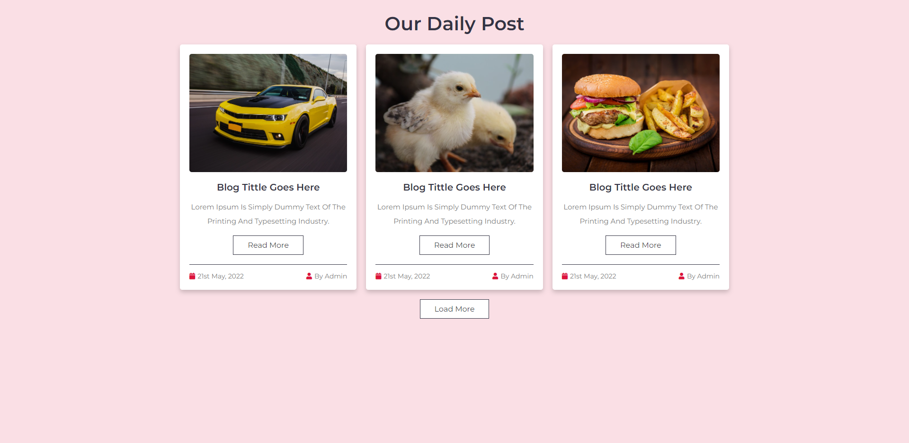

<h1 align="center">Project Load More</h1>

  <a href="#open_book-sobre">Sobre</a>
  &nbsp;&nbsp;&nbsp;|&nbsp;&nbsp;&nbsp;
  <a href="#hammer-tecnologias">Tecnologias</a>
  &nbsp;&nbsp;&nbsp;|&nbsp;&nbsp;&nbsp;
  <a href="#rocket-resultado">Resultado</a>

## :open_book: Sobre
Este repositório contêm 1 pagina que mostra a funcionalidade de ocutar os itens da view e atraves de um botão poder revelar aos poucos os itens ocutados.

## :hammer: Tecnologias
Este projeto foi feito com as seguintes tecnologias:
- HTML5
- CSS3
- Java Script

## :rocket: Resultado

  
  

 

:computer: Link do tutorial seguido : [Canal no Youtube - Mr. Web Designer](https://www.youtube.com/watch?v=4UZdSp9PMI4)